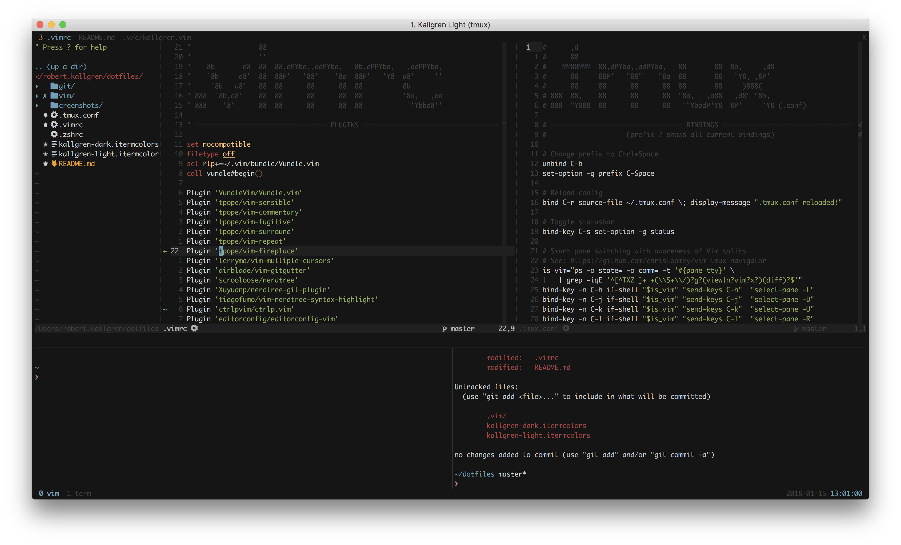
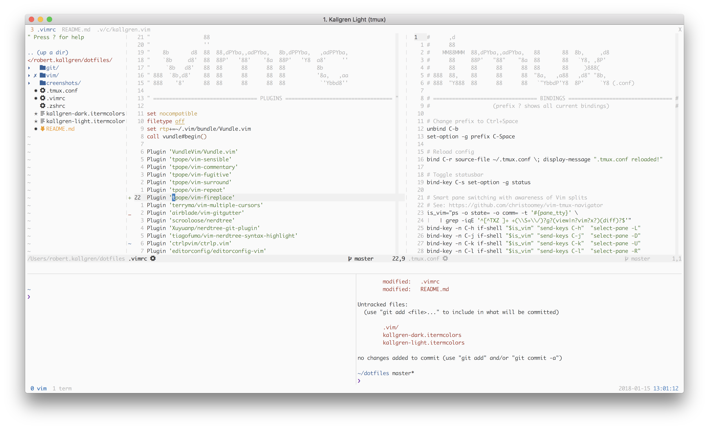
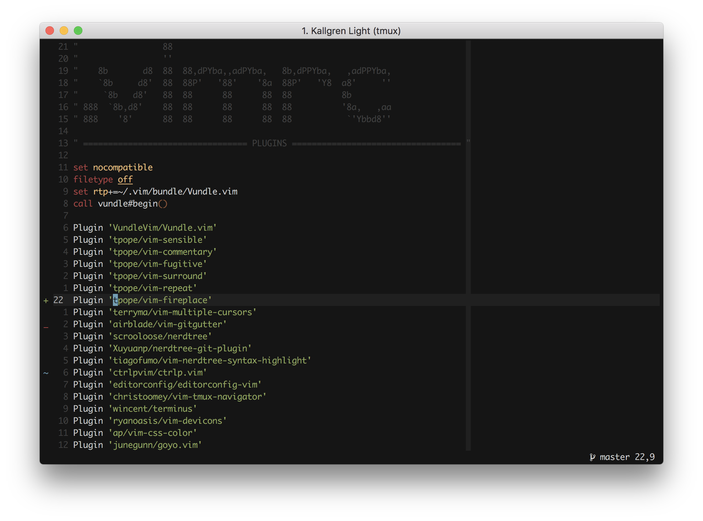
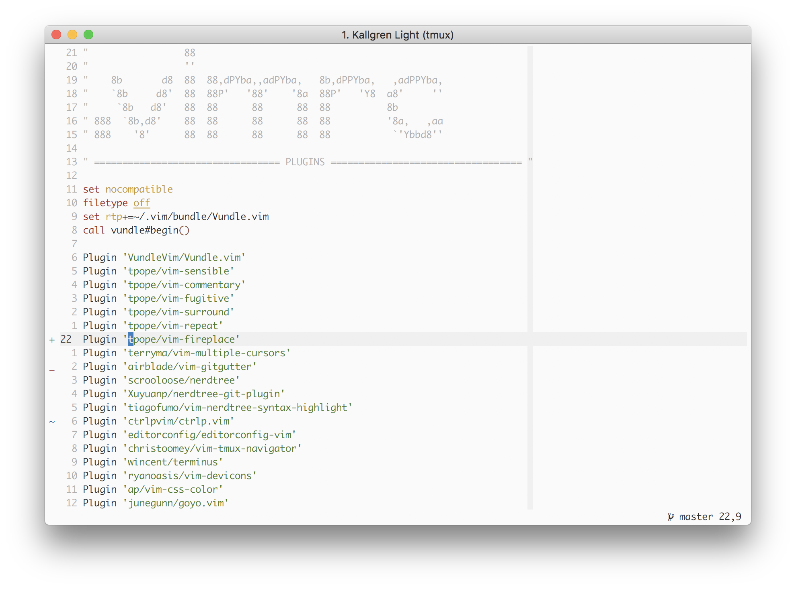
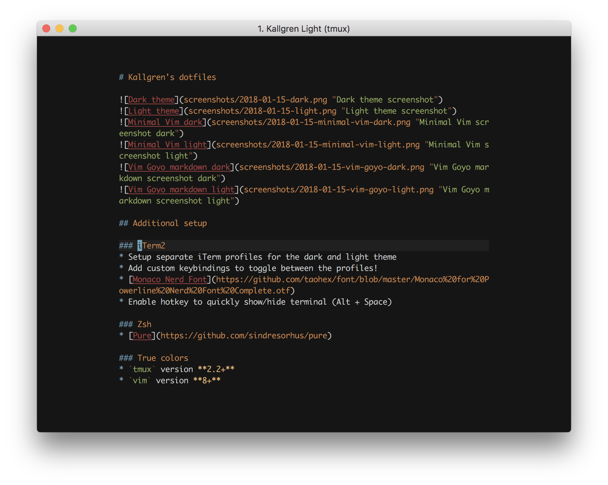
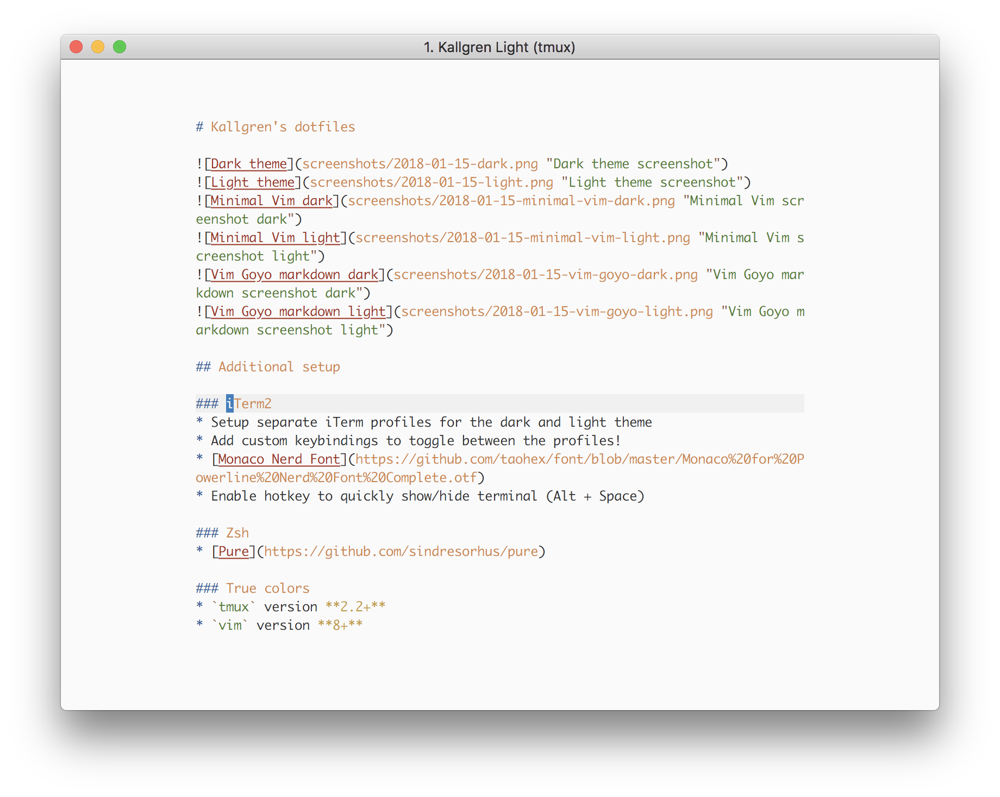

# Kallgren's dotfiles 🙃

## Setup

### Term & Vim

1. [iTerm2](https://www.iterm2.com/)
2. [Monaco Nerd Font](https://github.com/taohex/font/blob/master/Monaco%20for%20Powerline%20Nerd%20Font%20Complete.otf)
3. [Homebrew](https://brew.sh/)
4. [Oh My ZSH!](https://ohmyz.sh/)
5. [Pure](https://github.com/sindresorhus/pure)
6. `brew install vim` (Apple's shipped `vim` version may not have the `termguicolors` feature enabled)
7. `brew install tmux`
8. `git clone https://github.com/tmux-plugins/tpm ~/.tmux/plugins/tpm`
9. `git clone https://github.com/VundleVim/Vundle.vim.git ~/.vim/bundle/Vundle.vim`
10. `git clone git@github.com:kallgren/dotfiles.git ~`
11. `ln -s ~/dotfiles/.vimrc ~/dotfiles/.tmux.conf ~/dotfiles/.zshrc ~`
12. `mkdir -p ~/.vim/colors && cp ~/dotfiles/colors/kallgren.vim "$_"`
13. Open and configure iTerm2:
    1. Switch to _Monaco Nerd Font_ installed earlier
    2. Create separate profiles for the dark and light theme and import the _.itermcolors_ files
    3. Add custom keybindings to toggle between the profiles! (<kbd>Ctrl</kbd> + <kbd>Cmd</kbd> + <kbd>k</kbd>/<kbd>l</kbd>)
14. Fire up `tmux` + `vim`
15. Install vim plugins by running `:PluginInstall` inside vim
16. Install tmux plugins by pressing _prefix_ (<kbd>Ctrl</kbd> + <kbd>Space</kbd>), <kbd>I</kbd>
17. Done! ✌️ Switch between the light and dark color themes in vim, tmux and iterm2 at once from within vim with the single key binding <kbd>,</kbd><kbd>b</kbd><kbd>g</kbd>

### VS Code

1. [Download](https://code.visualstudio.com/)
2. `ln -s ~/dotfiles/.vscode/settings.json ~/dotfiles/.vscode/keybindings.json ~/Library/Application\ Support/Code/User/`
3. Open up this repository with VS Code and install the recommended extensions

### Bear

1. [Download](https://bear.app/)

### BetterTouchTool

1. [Download](https://folivora.ai/)
2. Import _kallgren.bttpreset_
3. Adjust trackpad rotate gesture settings (for knob-style volume control) (because it is not included in settings export): 
    - _Rotate block time_: 0.01
    - _Set needed rotation amount (degree)_: ~3

The preset includes:
- App toggle keybindings (on left hand on my keyboard) for commonly used applications, using <kbd>Hyper</kbd> (<kbd>Shift</kbd> + <kbd>Ctrl</kbd> + <kbd>Option</kbd> + <kbd>Command</kbd>)
- Window management keybindings (on right hand on my keyboard) using <kbd>Hyper</kbd> with logical placements (exploiting symbol combos to extend options, and using num layer for more complex or specific window configurations, see QMK config)
- Touch gestures for volume and brightness control
- Clipboard history on <kbd>Hyper</kbd> + <kbd>v</kbd>

### macOS

- Setup <kbd>Alt</kbd> + <kbd>Tab</kbd> to toggle windows within application
- Install [Monitor Control](https://github.com/MonitorControl/MonitorControl) to enable native macOS volume and brightness control of external monitor

### Keyboard

- Planck: install QMK and flash [firmware](https://github.com/kallgren/qmk-firmware)