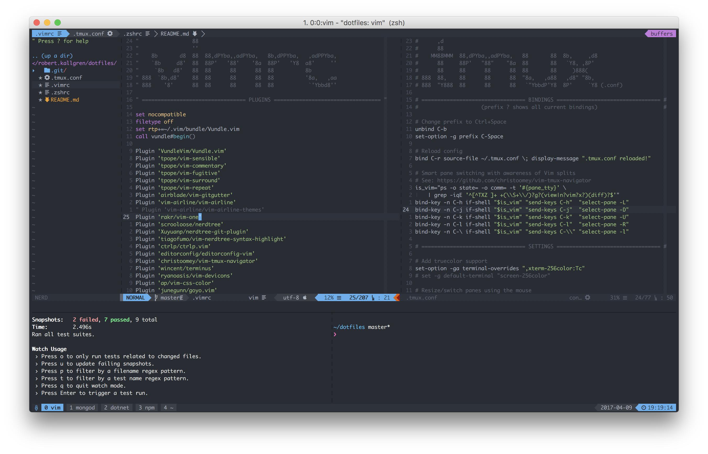

# Kallgren's dotfiles

## Additional setup

### iTerm2
* Background color to match vim-one (`#282c34`)
* Cursor color to match vim-one (`#61afef`)
* [Monaco Nerd Font](https://github.com/taohex/font/blob/master/Monaco%20for%20Powerline%20Nerd%20Font%20Complete.otf)

### Zsh
* [Pure](https://github.com/sindresorhus/pure)

### True colors
* `tmux` version **2.2+**
* `vim` version **8+**
