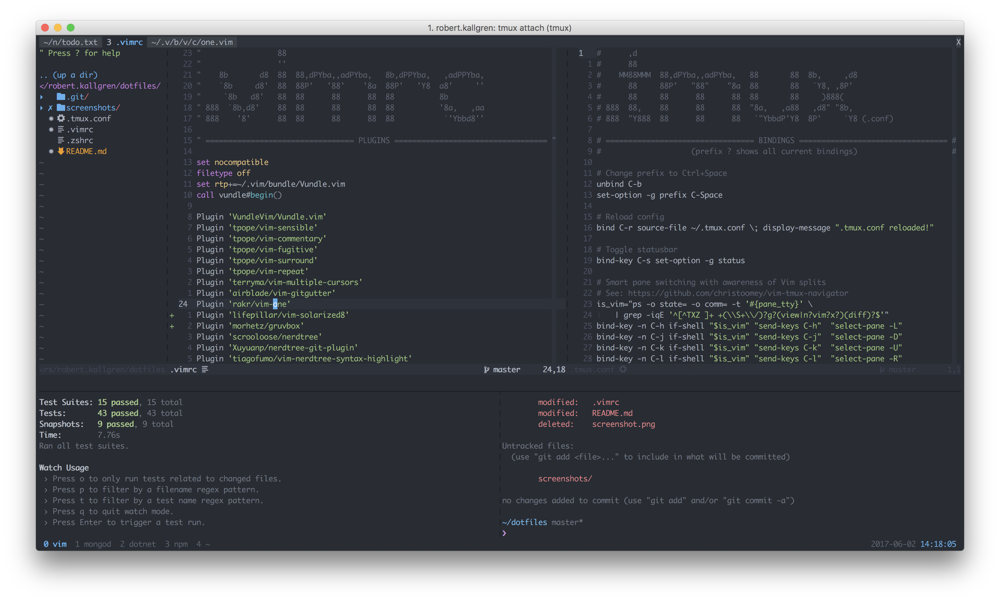
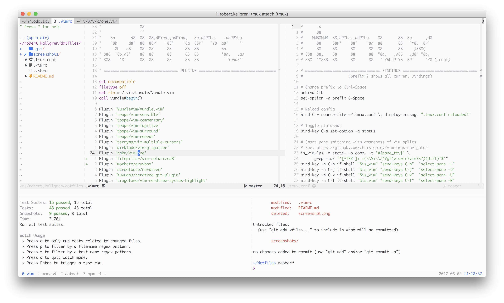
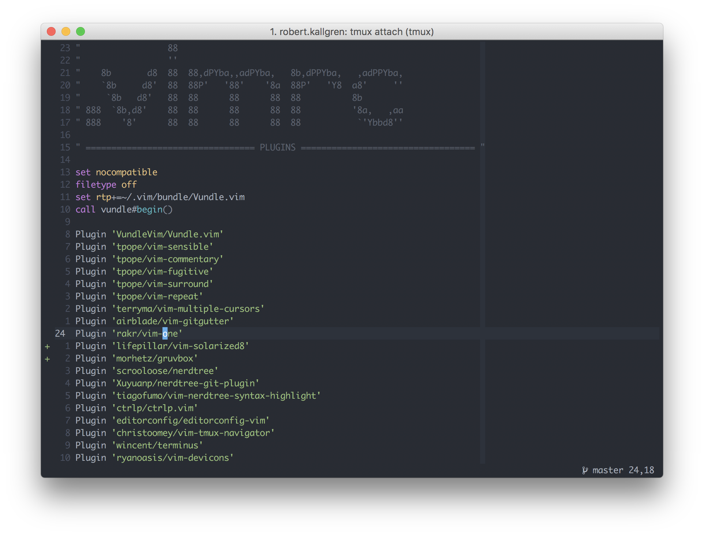
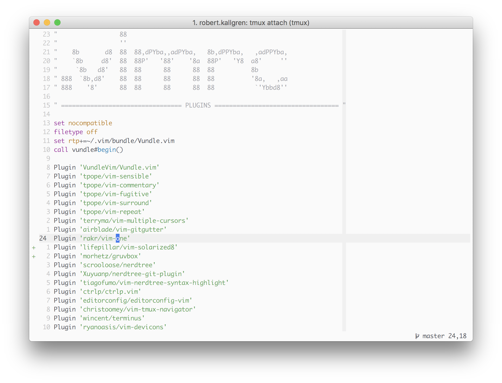
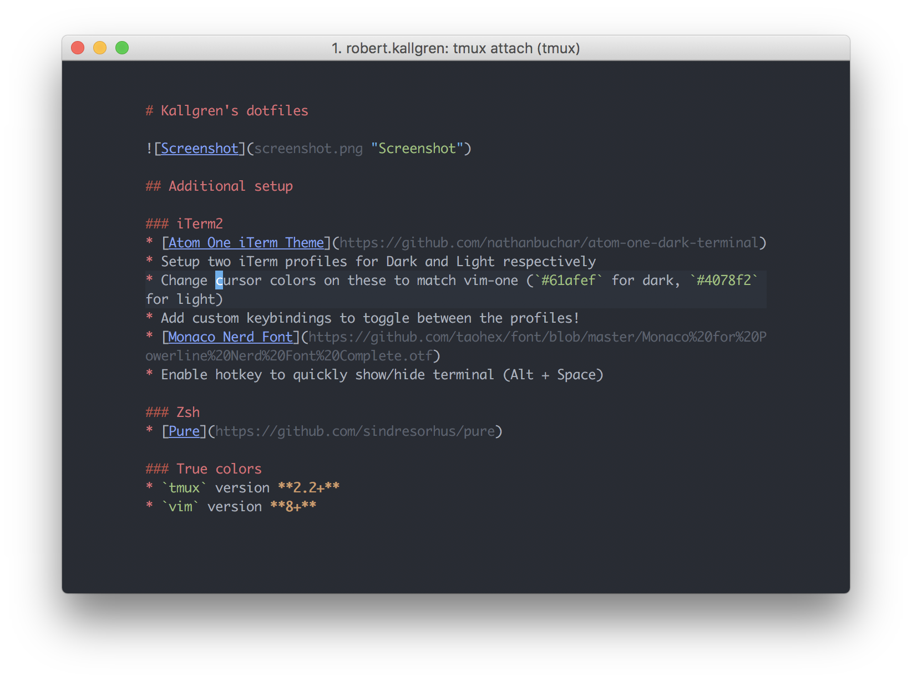
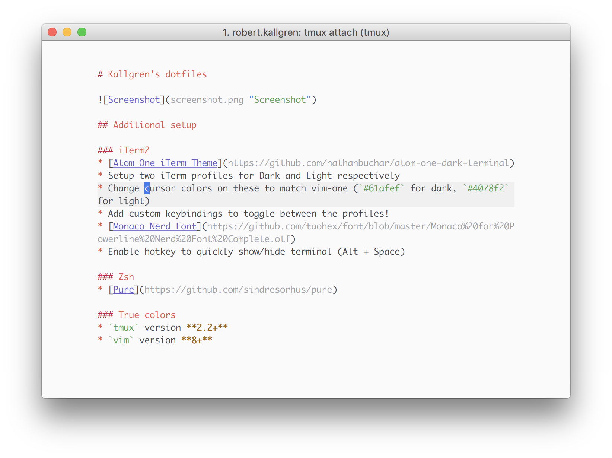

# Kallgren's dotfiles

## Additional setup

### iTerm2
* [Atom One iTerm Theme](https://github.com/nathanbuchar/atom-one-dark-terminal)
* Setup two iTerm profiles for Dark and Light respectively
* Change cursor colors on these to match vim-one (`#61afef` for dark, `#4078f2` for light)
* Add custom keybindings to toggle between the profiles!
* [Monaco Nerd Font](https://github.com/taohex/font/blob/master/Monaco%20for%20Powerline%20Nerd%20Font%20Complete.otf)
* Enable hotkey to quickly show/hide terminal (Alt + Space)

### Zsh
* [Pure](https://github.com/sindresorhus/pure)

### True colors
* `tmux` version **2.2+**
* `vim` version **8+**
